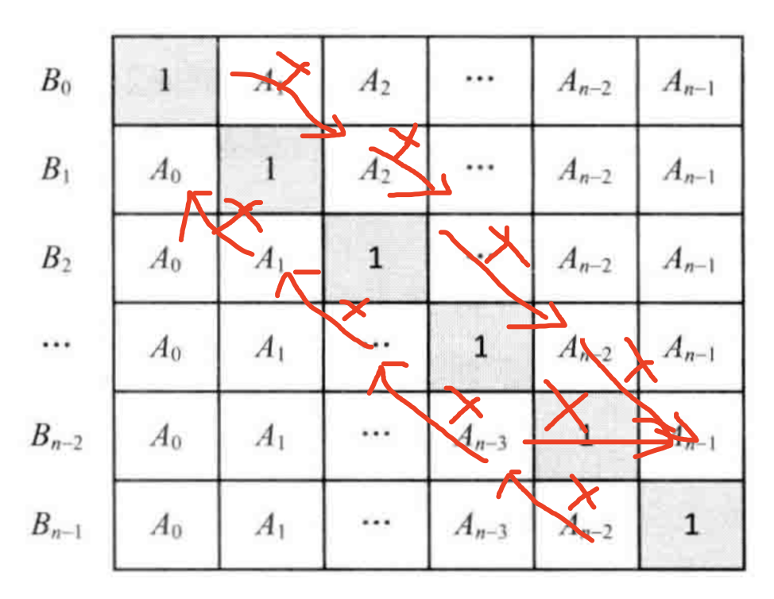

# 算法学习专项

https://juejin.cn/post/6844903919722692621#heading-14

http://www.conardli.top/docs/dataStructure/

# 一、时间复杂度和空间复杂度
## 1.1 时间复杂度
一个算法的时间复杂度反映了程序运行从开始到结束所需要的时间。把算法中基本操作重复执行的次数，作为算法的时间复杂度。

没有循环的语句，记住O(1)，也称为常数阶。只有一重循环，则算法的基本操作的执行频度与问题规模n呈线性增大关系，记住O(n)，叫线性阶。

## 1.2 常见的时间复杂度
- O(1)
- O(log n)
- O(n)
- O(n^2)
- O(n^3)
- O(2^n)
- O(n!)

## 1.2 空间复杂度
一个程序的空间复杂度是指运行完一个程序所需内存的大小。利用程序的空间复杂度，可以对程序的运行所需要的内存多少有个预估。

# 2. 数据结构
> 数据元素相互之间存在的一种和多种特定的关系集合。
一般可以从逻辑结构和存储结构理解。
## 2.1 逻辑结构
数据之间的关系，逻辑结构大概统一的可以分成：线性结构、非线性结构。

线性结构：一个有序数据元素的集合。其中数据元素之间的关系是一对一的关系，即除了第一个和最后一个数据元素之外，其他数据元素都是首尾相连。

常用的线性结构：栈、队列、链表、线性表

非线性结构：各个数据元素不再保持在一个线性序列中，每个数据元素可能与零个或者多个其他数据元素发生关系。

常见的非线性结构有 二维数组、树等

## 2.2 存储结构
逻辑结构指的是数据间的关系，而存储结构是逻辑结构用计算机语言的实现，创常见的存储结构有顺序存储、链式存储、索引存储以及散列存储。

例如：数组在内存中的位置是连续的，它属于顺序存储；链表是主动建立数据间的关联关系的，在内存中却不一定是连续的，它属于链式存储；还有顺序和逻辑上都不存在顺序的关系，但是你可以通过一定的方式去访问它的哈希表，数据散列存储。

## 2.3 数据结构 - 二叉树
模拟具有树状结构性质的数据集合。
### 2.3.1 二叉树遍历
#### 2.3.1.1 中序遍历
```JavaScript
var tree = {
  root: {
    val: 1,
    left: {
      val: null
    },
    right: {
      val: 2,
      left: {
        val: 3
      }
    }
  }
}
```
## 2.4 数据结构 - 链表
### 2.4.1 概览
用一组任意存储的单元来存储线性表的数据元素。一个对象存储着本身的值和细哦一个原则的地址
- 需要遍历才能查询到元素，查询慢
- 插入元素只需要断开链接重新赋值，插入快
### 2.4.2 从尾到头打印链表
```JavaScript
function printListFromTailToHead (head) {
  const array = []
  while (head) {
    array.unshift(head.val)
    head = head.next
  }
  return array
}
```
### 2.4.3 反转链表

```JavaScript
node1 = {
  val: 1,
  next: node2
}

node2 = {
  val: 2,
  next: node3
}

node3 = {
  val: 3,
  next: null
}
// 让当前node节点的next指向上一个
var reverseList = function(head) {
    var prev = null
    var current = head
    while (current) {
      let next = current.next
      current.next = prev
      prev = current
      current = next
    }
    return prev
};
```
### 2.4.4 复杂链表的复制
输入一个复杂链表（每个节点中有节点值，以及两个指针，一个指向下一个节点，另一个特殊指针执行任意一个节点），返回结果为复制后复杂链表的head

思路

- 1. 复制一份链表放在前一个节点后面，即根据原始链表的每个节点N创建N，把N直接放在N的next位置，让复制后的链表和原始链表组成新的链表
- 2. 给复制的链表randon复制，即N.random=N.random.next
- 3. 拆分链表，将N`和N进行拆分，保证原始链表不受影响


```JavaScript

function clone(pHead) {
  if (!pHead) {
    return null
  }
  cloneNodes(pHead)
  cloneRandom(pHead)
  return reconnectNodes(pHead)
}

function cloneNodes(pHead) {
  var current = pHead
  while (current) {
    var cloneNode = {
      val: current.val,
      next: current.next
    }
    current.next = cloneNode
    current = cloneNode.next
  }
}

function cloneRandom(pHead) {
  var current = pHead
  while(current) {
    var cloneNode = current.next
    if (current.random) {
      cloneNode.random = current.random.next
    } else {
      cloneNode.random = null
    }
    current = cloneNode.next
  }
}

function reconnectNodes(pHead) {
  var cloneHead = pHead.next
  var cloneNode = pHead.next
  var current = pHead
  while (current) {
    current.next = cloneNode.next
    current = cloneNode.next
    if (current) {
      cloneNode.next = current.next
      cloneNode = current.next
    } else {
      cloneNode.next = null
    }
  }
  return cloneHead
}
```
### 2.4.5 合并两个排序的链表
解题思路

```JavaScript
function merge(pHead1, pHead2) {
  if (!pHead1) {
    return pHead2
  }
  if (!pHead2) {
    return pHead1
  }

  let head
  if (pHead1.val < pHead2.val) {
    head = pHead1
    head.next = merge(pHead1.next, pHead2)
  } else {
    head = pHead2
    head.next = merge(pHead1, pHead2.next)
  }
  return head
}
```

### 2.4.6 链表倒数第k个节点
输入一个链表，输出该链表中倒数第k个节点
```JavaScript
// 1 2 3 4 5
function findKthToTail(head, k) {
  if (!head || !k) {
    return null
  }
  let current = head
  let result = head
  let index = 1
  while (current.next) {
    index++
    current = current.next
    if (index > k) {
      result = result.next
    }
  }
  return (k <= index) && result
}
```

### 2.4.7 链表中环的入口
给一个链表，若其中包括环，请找出该链表的环的入口节点，否则，输出`null`
解题思路：
- 1. 先判读是否有环
p1和p2开始从头出发，p1走两步，p2走一步，如果可以相遇则环存在
- 2. 找出环的长度
从环内某个节点开始计数，再回到此节点得到链表的长度length
- 3. 找出公共的节点
让p1、p2回到head节点，让p1先走length步（想当于p1想走了一个环的长度，剩余的长度和环外的长度相等），当p1和p2相遇时即为链表环的起点
```JavaScript
function entryNodeOfLoop (head) {
  if (!head || !head.next) {
    return null
  }
  // 1. 先判读是否有环
  let p1 = head.next
  let p2 = head.next.next
  while (p1 !== p2) {
    if (p2 == null || p2.next === null) {
      return null
    }
    p1 = p1.next
    p2 = p1.next.next
  }
  // 2. 找到长度
  let temp = p1
  let length = 1
  p1 = p1.next
  while (p1 !== temp) {
    p1 = p1.next
    length++
  }

  // 3. 找到节点
  p1 = head
  p2 = head
  while (length-- > 0) {
    p1 = p1.next
  }
  while (p1 !== p2) {
    p1 = p1.next
    p2 = p2.next
  }
  return p1
}
```
### 2.4.8 两个链表的第一个公共节点
输入两个链表，找出它们的公共节点


思路：
- 1. 找出两个链表的长度: `length1`、`length2`
- 2. 让较长的两线先走length2 - length1步
- 3. 然后两个两步同时前进知道找到相同的第一个节点
```JavaScript
/**
 * Definition for singly-linked list.
 * function ListNode(val) {
 *     this.val = val;
 *     this.next = null;
 * }
 */

/**
 * @param {ListNode} headA
 * @param {ListNode} headB
 * @return {ListNode}
 */
var getIntersectionNode = function(head1, head2) {
    let length1 = getNodeLength(head1)
    let length2 = getNodeLength(head2)
    if (length1 > length2) {
      head1 = nodeAdvanceStep(head1, length1 - length2)
    } else {
      head2 = nodeAdvanceStep(head2, length2 - length1)
    }
    while (head1 !== head2) {
        head1 = head1.next
        head2 = head2.next
    }

  return head1
};

function nodeAdvanceStep (head, step) {
  if (!head) {
    return null
  }
  console.log(head.val, step)
  while (step-- > 0) {
    head = head.next
  }
  return head
}

function getNodeLength (head) {
  if (!head) {
    return null
  }
  let length = 0
  while (head) {
    head = head.next
    length++
  }
  return length
}
```
### 2.4.9 圈圈中最后剩下的数字
### 2.4.10 删除链表中的节点or重复的节点
#### 2.4.10.1 删除链表中的节点

- 1.删除的节点不是尾部节点 - 将next节点覆盖当前节点
- 2.删除的节点是尾部节点且等于头部节点，只剩一个节点 - 将头部节点只为null
- 3.删除的节点是尾节点且前面还有节点 - 遍历到未尾的前一个节点删除

```JavaScript
function deleteNode (head, node) {
  if (node.next) {
    node.val = node.next.val
    node.next = node.next.next
  } else if (node === head) {
    head = null
    node = null
  } else {
    node = head
    while (node.next.next) {
      node = node.next
    }
    node.next = null
    node = null
  }
  return null
}
```
#### 2.4.10.2 删除链表中重复节点
方法1. 存储链表中元素出现的次数
- 1. 用map存储每个节点出现的次数
- 2. 删除出现次数大于1的节点

方法2. 重新比较连接数组

链表是排好顺序的，所以重复元素都会相邻
- 1. 当前节点或当前节点的next为空，返回该节点
```JavaScript
var deleteDuplicates = function(head) {
    if (!head || !head.next) {
        return head
    } else if (head.val === head.next.val) {
        let nextNode = head.next
        while (nextNode && nextNode.val === head.val) {
            nextNode = nextNode.next
        }
        head.next = nextNode
        deleteDuplicates(nextNode)
        return head
    } else {
       head.next =  deleteDuplicates(head.next)
       return head
    }
};
```

## 2.5 数据结构 - 数组

### 2.5.1 把数组排成最小的数
输入一个正整数数组，把数组里所有数字拼接起来排成一个树，打印能拼接的所有数字中最小的一个。

本质是重新定义数组排序的规则。
```JavaScript
function printMinNumber(numbers) {
  if (!numbers || numbers.length == 0) {
    return ''
  }
  return numbers.sort(compare).join('')
}

function compare(a ,b) {
  const front = '' + a + b
  const behind = '' + b + a
  return front - behind
}
```

### 2.5.2 第一个只出现一次的字符
解法1：使用map记录出现的次数
```JavaScript
function firstNotRepeatingChar(str) {
  if (!str) {
    return -1
  }
  let countMap = {}
  for (let i = 0; i < str.length; i++) {
    if (countMap[str[i]]) {
      countMap[str[i]] = ++countMap[str[i]]
    } else {
      countMap[str[i]] = 1
    }
  }
  for (let i = 0; i < str.length; i++) {
    if (countMap[str[i]] === 1) {
      return str[i]
    }
  }
  return -1
}
```

### 2.5.3 调整数组顺序使奇数位于偶数前面  - 双指针实现
- start遍历到偶数，end遍历到奇数是交换位置
```JavaScript
function reOrderArray (array) {
  var start = 0
  var end = arr.length -1
  while (start > end) {
    while (array[start] % 2 === 1) {
      start++
    }

    while (array[start] % 2 === 0) {
      end++
    }
    [array[start], array[end]] = [array[end], array[start]]
  }
  return array
}
```

### 2.5.4 构建乘积数组
给定一个数组A[0,1,...,n-1],请构建一个数组B[0,1,...,n-1],其中B中的元素B[i]=A[0]*A[1]*...*A[i-1]*A[i+1]*...*A[n-1]。不能使用除法。

思路： b之前的数字乘 当前的a



```JavaScript
function  multiply(array) {
  let result = []
  result[0] = 1
  for (let i = 1; i < array.length; i++) {
    result[i] = result[i - 1] * array[i - 1]
  }

  let temp = 1
  for (let i = array.length - 2; i >= 0; i--) {
    temp = temp * array[i + 1]
    result[i] = result[i] * temp
  }
  return result
}
```
### 2.5.5 和为s的连续正整数序列（双指针）
输入一个正数S，打印出所有和为S的连续正数序列。

例如：输入15，有序1+2+3+4+5=4+5+6=7+8

思路：
- left从1开始， rigth从开始
- 如果和小于目标值， right向右移动，
- 如果和大于目标值， left向右移动，
- 如果相等，记录结果，right和left同时向右移动
```JavaScript
function findContinuousSequence(target) {
  let result = []
  let left = 1
  let right = 2
  let sum = left + right
  while (left <= target / 2) {
    if (sum < target) {
      sum += ++right
    } else if (sum > target) {
      sum -= left--
    } else {
      let child = []
      for (let i = left; i <= right; i++) {
        child.push(i)
      }
      result.push(child)
      sum += ++right
      sum -= left--
    }
  }
  return result
}
```
### 2.5.6 和为s的两个数字（双指针）
输入一个递增排序的数组和一个数字s,在数组中查找两个数，使得他们的和正好是S，如果有多对数， 输出两个数乘积最小的

```JavaScript
function findNumbersWithSum(array, target) {
  let left  = 0
  let right = array.length - 1
  while (left < right) {
    let sum = array[i] + array[j]
    if (target < sum) {
      left++
    } else if (target > sum) {
      right--
    } else {
      return [array[i], array[j]]
    }
  }
  return []
}
```

### 2.5.7 连续子数组的最大和（动态规划）
输入一个整型的数组，数组里有正数也有负数。数组中的一个或连续多个数组组成一个字数组，求所有子数组的和的最大值

思路： 动态规划方法

- 1. 先找到以nums[i]结尾的连续子数组的最大和
- 2. 从中找出最大的那个
```JavaScript
function findSumOfSubArray(array) {
  let sum = array[0]
  let max = array[0]
  for (let i = 1; i < array.length; i++) {
    if (sum < 0) {
      sum = array[i]
    } else {
      sum = sum + array[i]
    }

    if (sum > max) {
      max = sum
    }
  }
  return max
}
```
### 2.5.8 两数之和
思路： 使用一个map将遍历过来的数字存起来，

- 取map中查找是否有key为target-number[i]的值
```JavaScript
function towSum(arr, target) {
  const map = {}
  for (let i = 0; i < arr.length; i++) {
    if (map[target - number[i]] !== undefined) {
      return [map[target- number[i]], i]
    } else {
      map[arr[i]] = i
    }
  }
  return []
}
```
做题的成就感使我着迷。
### 2.5.9 扑克牌顺序
扑克牌中随机抽5张牌，判断是不是一个顺子，大小王可以看成任何数字，也可以当0处理

思路一：
- 排序
- 判读大小王的个数必须小于或等于间隔数
```JavaScript
var isStraight = function(nums) {
  nums.sort((a,b) => a - b)
  let kingMum = 0
  let spaceNum = 0
  for (let i = 0; i < nums.length - 1; i ++) {
    if (nums[i] === 0) {
      kingMum++
    } else {
      const space = nums[i+1] - nums[i]
      if (space === 0) {
          return false
      } else {
          spaceNum += space - 1
          console.log('spaceNum', spaceNum)
      }
    }
  }
  return spaceNum <= kingMum
};
```

思路二：
- 最大数和最小数的间隔 < 5

### 2.5.10 三数之和
给定一个包含n个整数的数组nums,判断nums中是否存在三个元素a,b,c，使得`a+b+c=0?`找出所有满足条件且不重复的三元组

思路：
- 1. 先排序
- 2. 遍历，取当前nums[i]为一个准基数，遍历后面的数组
- 3. 设定两个起点，最左侧的left和right
- 4. 判断是否等于0，如果大于0，则right向左移动，如果小于0，则left向右移动
```JavaScript
function threeSum(nums) {
  const result = []
  nums.sort((a, b) => a - b)
  for (let i = 0; i < nums.length; i++) {
    if (i && nums[i] === nums[i-1]) {
      continue;
    }
    let left = i + 1
    let right = nums.length - 1
    while (left < right) {
      const sum = nums[i] + nums[left] + nums[right]
      if (sum > 0) {
        right--
      } else if (sum < 0) {
        left++
      } else {
        result.push([nums[i], nums[left++], nums[right--]])
        // 跳过重复的数字
        while (nums[left] === nums[left - 1]) {
          left++
        }

        while (nums[right] === nums[right + 1]) {
          right--
        }
      }
    }
  }
  return result
}
```

### 2.5.11 数组中出现次数超过数组长度一般的数字
数组中有一个数字出现的次数超过了数组长度的一半，找出这个数字。

思路一：使用map统计出现次数，然后返回

思路二：排序

思路三：投票算法

如果把众数记+1，把其他数记-1，将它们全部加起来，显然和大于0


```JavaScript
// 思路二：排序 取中间的值
function findNum(array) {
  array.sort((a, b) => a - b)
  return array[Math.floor(array.length / 2)]
}

// 思路三：投票算法

function findNum(array) {
  let count = 0
  let candidate = array[0]
  for (let i = 0; i < array.length; i++) {
    if (count === 0) {
      candidate = array[i]
    }
    count += (array[i] === candidate) ? 1 : -1
  }
  return candidate
}
```

### 2.5.12 数组中的逆序对


## 2.6 数据结构 - 栈和队列
## 2.7 数据结构 - 哈希表
## 2.8 数据结构 - 堆