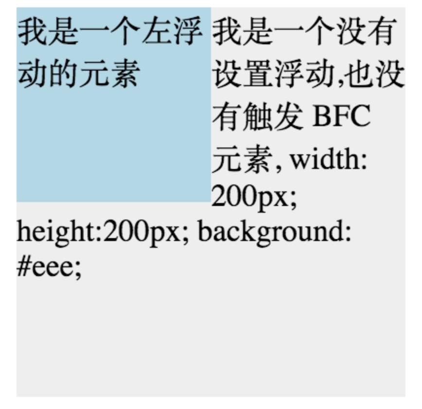

# 1. 基本概念：标准模型+IE模型
盒模型包括：content、padding、margin、border
# 2. 标准模型和IE模型的区别
IE模型元素宽度 width = content + padding + border

标准模型宽度width = content

# 3. css如何获取获取宽
css3新增属性：`box-sizing: content-box | border-box` 设置标准模型和IE模型

# 4. 外边距重叠
只用普通文档流的垂直边距才会发生外边距合并，行内框、浮动框或绝对定位之间的外边距不会合并。

# 5. BFC
https://zhuanlan.zhihu.com/p/25321647

块级格式化上下文。

BFC决定了元素如何对其内容进行定位，以及与其他元素的关系和相互作用。

一个环境中的元素不会影响到其他环境中的布局。

## BFC的原理（渲染规则）
- 1. 同一个BFC下外边距会发生折叠
- 2. BFC元素是一个独立的容器，外面的元素不会影响里面的元素。里面的元素也不会影响外面的元素
- 3. BFC的区域不会与浮动元素的布局重叠
之前

- 4. 计算BFC高度的时候，浮动元素也会参与计算(清除浮动)
 浮动
 之前

## 如何创建BFC
- 1. overflow不为visible
- 2. float的值不为none
- 3. position的值不为static或relative
- 4. display 为 inline-block、table-cells、flex...
- 5. body根元素