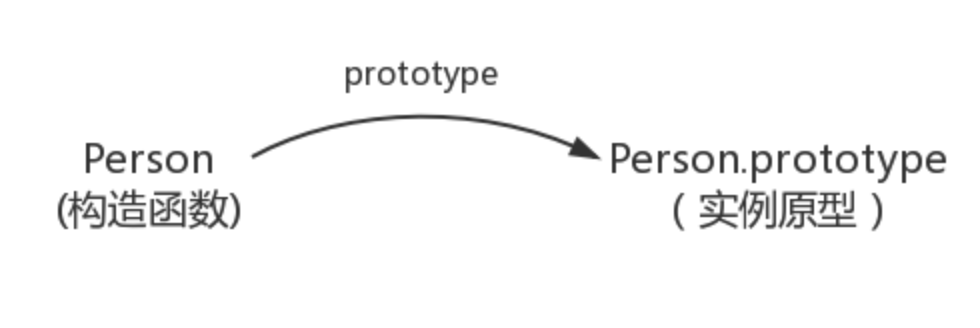
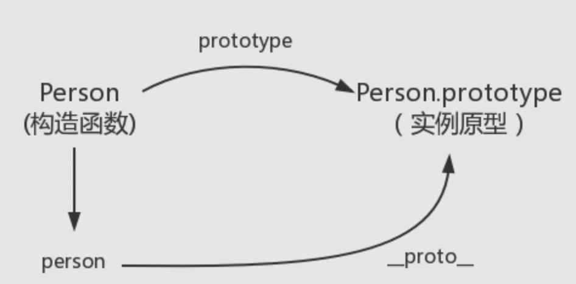
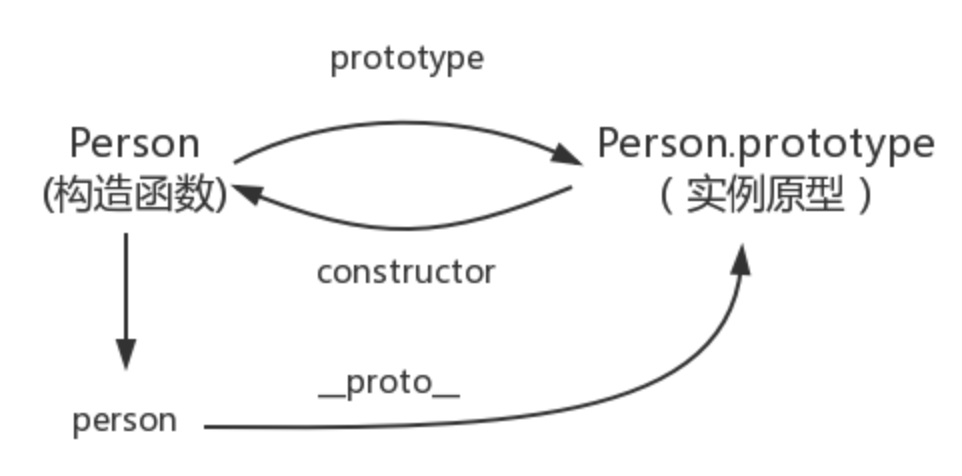
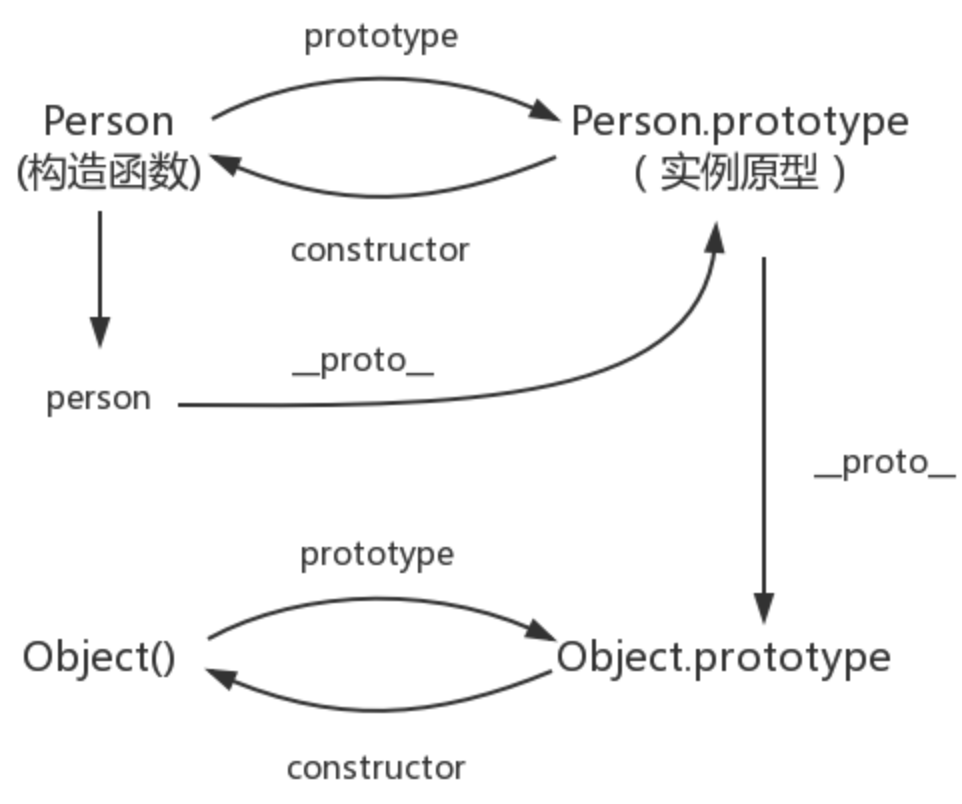
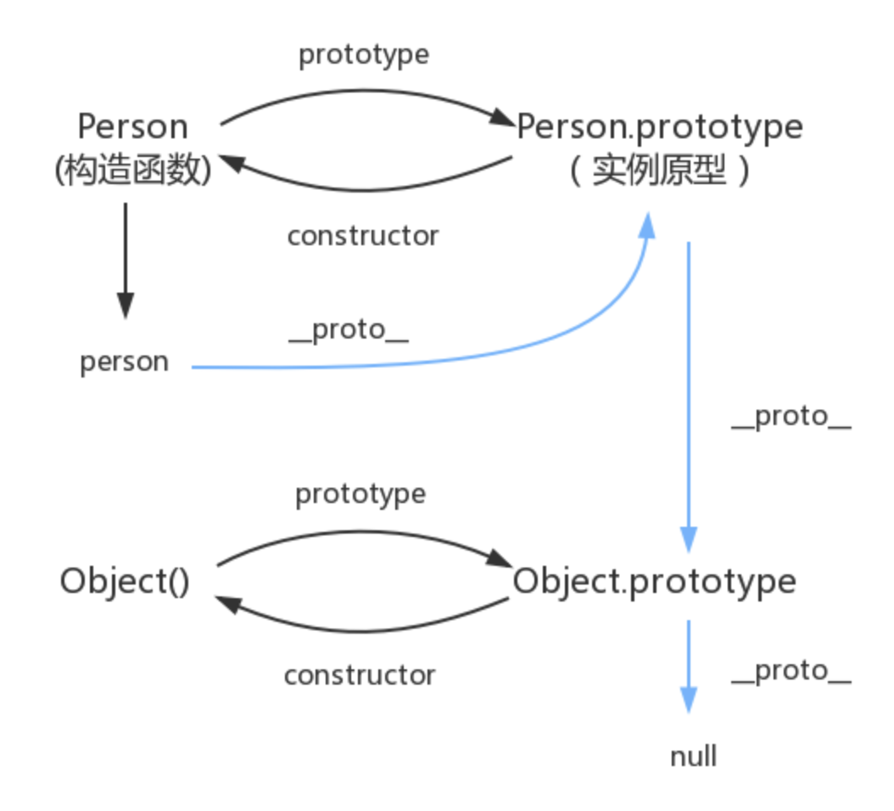

# 1. 原型链和原型
https://github.com/mqyqingfeng/Blog/blob/master/articles/%E6%B7%B1%E5%85%A5%E7%B3%BB%E5%88%97%E6%96%87%E7%AB%A0/JavaScript%E6%B7%B1%E5%85%A5%E4%B9%8B%E4%BB%8E%E5%8E%9F%E5%9E%8B%E5%88%B0%E5%8E%9F%E5%9E%8B%E9%93%BE.md
## 1.1 构造函数
先使用构造函数常见一个对象

```JavaScript

function Person() {

}
var person = new Person()
person.name = 'Kevin'
console.log(person.name) // Kevin

```

Person就是一个构造函数，使用new创建了一个实例对象person.

## 1.2 prototype

每个函数都有一个`prototype`属性，比如：
```JavaScript
function Person() {
}
Person.prototype.name = 'Ke'
var person1 = new Person()
var person2 = new Person()
console.log(person1.name) // Kevin
console.log(person2.name) // Kevin
```
函数的`prototype`属性指向了一个对象，这个对象正是调用该构造函数而创建的**实例**的原型，也就是例子中的`person1`和`person2`的原型。

原型：每个JavaScript对象在创建的时候就会与之关联另一个对象，这个对象就是原型，每个对象都会从原型继承属性。

当前关系图：


怎么表示实例与实例原型，也就是person和Person.prototype之间的关系呢，使用`__proto__`

## 1.3 __proto__
每个JavaScript对象（null除外）都具有一个属性，叫`__proto__`，这个属性会指向该对象的原型
```JavaScript
function Person () {
}
var person = new Person()
console.log(person.__proto__ === Person.prototype) // true
```

关系图:




## 1.4 constructor
每个原型都有一个`constructor`属性指向关联的构造函数。
```JavaScript
function Person() {}
console.log(Person === Person.prototype.constructor) // true
```

当前关系图：



综上得出：
```JavaScript
function Person {}
var person = new Person()
person.__proto__ === Person.prototype // true
Person.prototype.constructor === Person // true
Object.getPrototypeOf(person) === Person.prototype // true
```

## 1.5 实例和原型
当读取实例的属性时，如果找不到，就会查找与对对象关联的原型中的属性，如果还查不到，就去找原型的原型，一直找到最顶层为止。

## 1.6 原型的原型
原型也是一个对象，原型对象是通过`Object`构造函数生成的，更新关系图：



## 1.7 原型链
原型的尽头是 `null`
`Object.prototype.__proto__ === null`
更新关系图：

