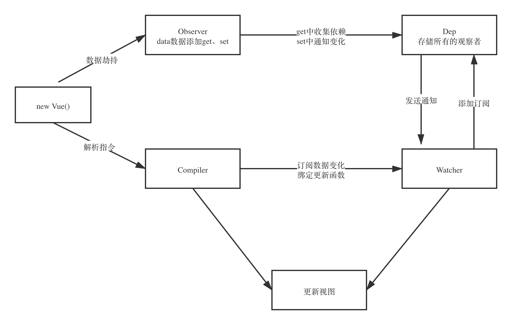

# 一、 Vue
## 1. Vue基础知识
### 1.1 差值表达式
### 1.2 指令
### 1.3 计算属性和侦听器
### 1.4 Class和String绑定
### 1.5 条件渲染/列表渲染
### 1.6 表单输入绑定
## 2. Vue语法和概念
### 2.1 组件
### 2.2 插槽
### 2.3 插件
### 2.4 混入mixin
### 2.5 深入响应式原理
### 2.6 不同构建版本的Vue
# 二、 Vue-Router实现原理
## 1.使用步骤
### 1.1. 注册路由插件
```JavaScript
Vue.use(VueRouter)

//路由规则
const routes = [
  {
    path: '/',
    name: 'Index',
    component: Index
  },
  {
    path: '/blog',
    name: 'Blog',
    component: () => import(/* webpackChunkName: "blog" */ '../views/Blog.vue')
  },
  {
    path: '/photo',
    name: 'Photo',
    component: () => import(/* webpackChunkName: "photo" */ '../views/Photo.vue')
  },
]
```
### 1.2 创建router对象
```JavaScript
const router = new VueRouter({
  routes
})
```

### 1.3 注册router对象
```JavaScript
new Vue({
  router,
  render: h => h(App),
}).$mount('#app')
```

### 1.4 创建路由组件的占位符
```html
<router-view />
```
### 1.5 创建链接
```html
<div id="nav">
  <!-- 5. 创建链接 -->
  <router-link to="/">Index</router-link>
  <router-link to="/blog">Blog</router-link>
  <router-link to="/photo">Photo</router-link>
</div>
```

## 2.嵌套路由
children
## 3.嵌套路由
push、repalce、go方法
## 4.Hash和Hsitory模式区别
### 4.1 Hash模式
- URL中#后面的内容作为路径地址
- 监听hashchange事件
- 根据当前路由地址找到对应组件重新渲染
### 4.2 History模式
- 通过history.pushState()方法改变地址拦
- 监听popstate事件
- 根据当前路由地址找到对应组件重新渲染
## History模式的使用
- 服务器端处理
- nginx配置

## vue响应式原理



# 三、 Vue虚拟DOM
## 1.什么是Vitual DOM
由普通js对象来描述DOM对象
## 2.Snabbdom

A virtual DOM library with focus on simplicity, modularity, powerful features and performance.
### 2.1 模块作用
- Snabbdom的核心库并不能处理DOM元素的属性/样式/事件等，可以通过注册Snabbdom默认提供的模块来实现
- Snabbdom中的模块可以用来扩展Snabbdom的功能
- Snabbdom中的模块的实现是通过注册全局的钩子函数来实现的
### 2.3 源码分析
- h函数：调用vnode函数，创建vnode对象并返回
- vnode函数： 将真实dom转换成js对象
- patch函数：
