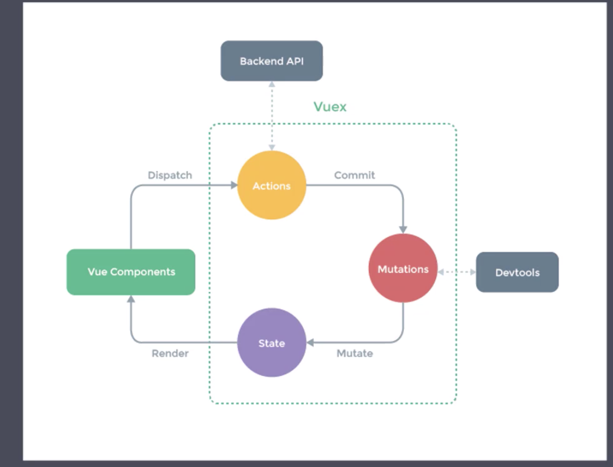

# 一、Vuex 状态管理
## 1. 组件内状态管理流程
- state: 数据源
- view： 以声明方式将state映射到视图
- action
view -> action -> state -> view
## 2. 组件间通信方式
### 2.1 父组件给子组件传值
- 子组件中通过props接收数据
- 父组件中给子组件通过相应属性传值
### 2.2 子组件给父组件传值
- vm.$emit
- vm.v-on
### 2.3 不相关组件传值
使用同一个vue实例

## 3. Vuex
### 3.1 什么是Vuex
- Vuex是专门为Vue.js设计的状态管理库
### 3.2 Vuex核心概念
#### 3.2.1 Store
#### 3.2.2 - State
- Getter
- Mutation
- Action
- Module

# 二、服务端渲染

## 1.
## 1.1 什么是渲染
把数据和模板拼接在一起

## 1.2

## 1.3 客户端渲染
#### 首屏渲染慢

## 1.4 同构渲染
服务端渲染（首次） + 客服端渲染
### 1.4.1 同构渲染应用的问题
#### 开发条件所限
- 浏览器特定的代码只能在某些生命周期钩子函数中使用
- 不能在服务端渲染期间操作DOM
#### 涉及构建设置和部署的更多要求
#### 更多的服务端负载
### 1.4.2 服务端使用的建议
- 首屏渲染速度是否真的重要
- 是否真的需要SEO

## 2. NuxtJs
